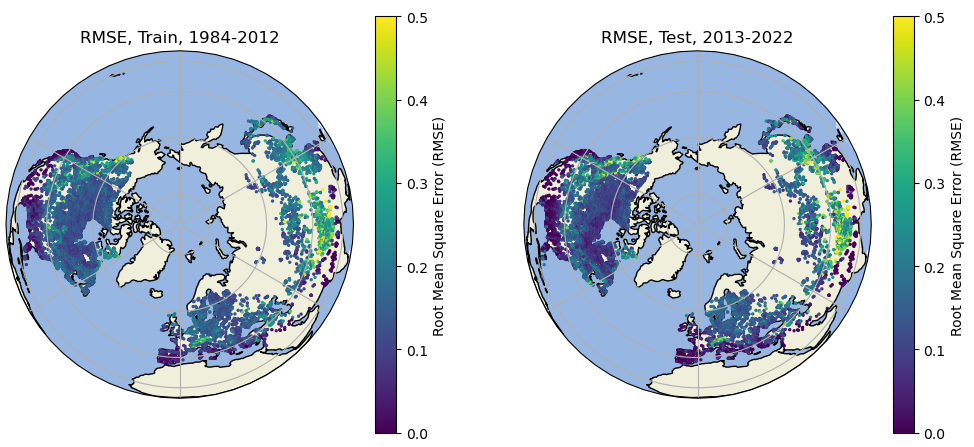

Recently, [our project team](https://www.necasc-winterdrawdown.com/) has been working on developing a universal model to simulate **daily** lake ice cover for nearly all lakes in the Northern Hemisphere. First, we followed the [2021 GRL paper](https://agupubs.onlinelibrary.wiley.com/doi/full/10.1029/2021GL095614) to use Landsat to retrieve long-term lake ice cover data for >33,000 lakes in the Northern Hemisphere (1985-2022). While Landsat can provide high-resolution (30m) observations on a global scale, the relative long revisiting period (~16 days) and influences from the cloud cover may result in large data gaps and potential incorrect estimates of the ice duration. In order to address these limitations, we trained a deep learning model: Long Short-Term Memory with the satellite observations from 1985-2012 (Landsat 5 & 7) to predict the daily lake ice cover using the [ERA5-Land](https://cds.climate.copernicus.eu/cdsapp#!/dataset/reanalysis-era5-land?tab=overview) daily meteorological data (e.g. air temperature) and static attributes from [HydroLAKES](https://www.hydrosheds.org/products/hydrolakes) (e.g. depth) as input.

We evaluated the model against the satellite observations during the test period (2013-2022, Landsat 8 & 9) to examine the ability of the model to predict future lake ice. The performance was satisfactory during the test period with a median Root Mean Square Error (RMSE) of 0.10 (Ice cover ranges from 0 to 1). Note the model has not seen the test data during training, this indicates a strong potential to apply the model to run future projections of lake ice.

