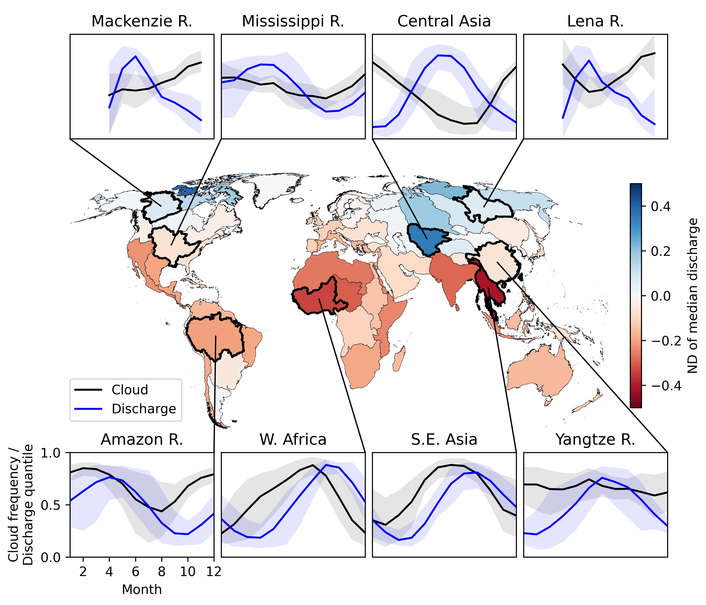

We often use remote sensing for environmental studies in hopes of reducing the geographic biases introduced by the availability of in-situ monitoring data. Global coverage and often sun-synchronous orbits provide a seemingly uniform view of the Earth's surface. However, atmospheric conditions vary both regionally and seasonally. For example, the central section of the Amazon basin, the world’s largest river by discharge, typically experiences more than 90% cloud cover during the wet season. This period is arguably the most important to monitor for hydrological study and could be entirely unobserved when relying on satellite optical remote sensing. 

Rapidly increasing spatial and temporal resolution of satellite sensors has increased the volume of available cloud-free optical data, but with daily high-resolution imagery now available, we are nearing a barrier that cannot be circumvented by better optical sensors alone. Kostas and I, along with co-author George Allen, recently submitted a manuscript to Geophysical Research Letters that characterizes the global impact of clouds on remote sensing observations of rivers. We analyzed 22 years of daily river discharge and cloud data covering 21,642 sections of rivers of various sizes and climates. Our findings reveal that cloud cover severely biases the distribution of river discharges we observe, especially for Tropical and Arctic rivers. This means that **satellite images do not accurately represent river conditions**. Our research provides the first comprehensive analysis of extent and impact of this bias. 

*In this figure, the color scale from red to blue indicates the amount of bias in the median river discharge when sampled only on cloud-free days. Negative bias (red) indicates that optical satellites underestimate the median discharge. We found that the severity and direction of this bias can be predicted by the relationship between cloud and discharge seasonality (see subplots above and below map).*

[**Read the preprint**](https://essopenarchive.org/users/551563/articles/911901-global-cloud-biases-in-optical-satellite-remote-of-rivers) or get in touch for more information.